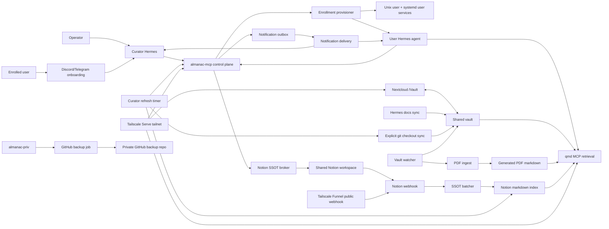

# Almanac

Almanac is a shared-host operating layer for Hermes agents.

It gives an operator one steady Curator agent, gives each enrolled user their
own isolated Hermes lane, and keeps everyone pointed at the same living
knowledge base: files in the vault, PDF-derived notes, synced documentation,
and shared Notion context.

The vibe is a control room, not a toy box. Almanac should feel calm, useful,
and a little magical because the boring parts are handled correctly: Unix
accounts, service repair, deploy keys, qmd indexing, Notion guardrails,
backups, onboarding, and recovery paths.

## What Ships Today

Almanac currently provisions and manages:

- A public infrastructure repo plus a nested private `almanac-priv/` repo.
- A shared vault on disk, exposed in Nextcloud as `/Vault`.
- qmd collections for authored vault files, PDF-ingested markdown, and indexed
  shared Notion pages.
- One operator-owned Curator Hermes agent.
- One isolated user Hermes agent per enrolled Unix account.
- Telegram and Discord onboarding, approval, user-agent gateway, and operator
  notification flows.
- Chutes, Claude Opus, and OpenAI Codex model onboarding.
- Claude Opus through Claude Code OAuth credentials, not Anthropic API keys.
- Chutes through `https://llm.chutes.ai/v1` as an OpenAI-compatible Hermes
  custom provider.
- Thinking-level selection for agents, with Chutes `:THINKING` model handling
  when enabled.
- Shared Notion SSOT reads and safe writes through an Almanac broker.
- Vault, skills, plugins, Notion, upgrade, and assigned-work notifications.
- PDF extraction into generated markdown, with optional vision captions.
- Repo sync for explicitly cloned git checkouts inside the vault.
- GitHub backup for `almanac-priv/`.
- Optional per-user Hermes-home backups.
- Optional remote control of a user agent over Tailscale SSH.
- Health, repair, enrollment cleanup, and upgrade tooling.

The important design choice: agents do not need to rummage around blindly.
They get high-level MCP tools that know the shape of Almanac.

## Mental Model

```text
operator
  owns Curator
  approves enrollments
  repairs and upgrades the host

Curator
  handles onboarding
  routes notifications
  keeps vault and Notion context fresh

enrolled user
  gets a Unix account
  gets a private Hermes home
  gets a bot lane and optional remote SSH lane

user agent
  retrieves from qmd
  writes through the Notion SSOT broker
  receives vault/skill/plugin/Notion/work notifications
```

The vault is the durable memory deck. qmd is the fast retrieval engine. Notion
is the shared work surface. Curator is the pit crew.

## Architecture



## Repository Layout

The intended deployed layout is:

```text
/home/almanac/
  almanac/                 # public repo: scripts, units, templates, skills
    almanac-priv/          # private nested repo: config, vault, runtime state
```

`almanac-priv/` contains the sensitive and living parts:

```text
almanac-priv/
  config/
    almanac.env
  vault/
  published/
  quarto/
  state/
    agents/
    curator/
    nextcloud/
    notion-index/
    pdf-ingest/
    runtime/
```

The public repo ignores `almanac-priv/`. Back up the inner private repo, not
the outer infrastructure repo.

## Host Requirements

Supported shared-host environments:

- Debian or Ubuntu-style Linux with `apt`, `systemd`, and `loginctl`.
- WSL2 Ubuntu when systemd is enabled.
- An Ubuntu VM.

Not supported as a full host:

- Native macOS.
- Machines without systemd user services.

You can still use helper commands from macOS or another workstation, but the
actual shared-host stack expects Linux system services.

## Quick Start

From the repo root:

```bash
./deploy.sh
```

Common direct modes:

```bash
./deploy.sh install                 # install or repair from this checkout
./deploy.sh upgrade                 # upgrade deployed host from configured upstream
./deploy.sh health                  # full host health check
./deploy.sh curator-setup           # repair Curator only
./deploy.sh notion-ssot             # configure shared Notion
./deploy.sh enrollment-status
./deploy.sh enrollment-align
./deploy.sh enrollment-reset
./deploy.sh rotate-nextcloud-secrets
./bin/almanac-ctl upgrade check
```

Install asks for the service user, repo paths, org identity fields, Tailscale
and Nextcloud settings, model presets, Notion, deploy keys, private backup
remote, and optional Quarto support. It asks first, then uses `sudo` only for
the steps that need root.

## First Install Checklist

Before a serious install, have these ready:

- A Linux host where the operator can use `sudo`.
- A GitHub repo for this public `almanac` codebase.
- A private GitHub repo for `almanac-priv` backup.
- Tailscale on the host if you want tailnet-only browser, MCP, and remote
  agent access.
- A Discord or Telegram operator channel if you want chat approvals.
- Optional Notion internal integration token for the shared SSOT workspace.
- Optional Chutes API key for Chutes-powered agents.
- Claude account access for Claude Code OAuth lanes.
- OpenAI/Codex sign-in if you want Codex lanes.

## Deploy Keys

Almanac intentionally keeps deploy keys separate:

- **Almanac upstream deploy key**: read/write key for operator or agent code
  pushes to the public `almanac` repo.
- **`almanac-priv` backup deploy key**: read/write key for private host
  backup.
- **Per-user agent backup deploy key**: read/write key for that user's private
  Hermes-home backup repo.

Do not reuse those keys. Different blast radius, different job.

During `deploy.sh install`, Almanac can generate the upstream key, print the
public key, print the GitHub deploy-key settings URL, and verify read plus
dry-run write access once you enable **Allow write access** in GitHub.

For `almanac-priv`, health checks refuse unsafe backup shapes. A backup target
should be private.

## Upgrades

Use:

```bash
./deploy.sh upgrade
```

Upgrade fetches the configured upstream repo and branch from `almanac.env`,
syncs the deployed public repo, refreshes shared services, repairs Curator,
records the release state, and ends with health.

Curator also runs:

```bash
./bin/almanac-ctl upgrade check
```

on a timer. It can notify the operator when upstream has moved. If the
operator deploy key is owned by a human account, the service-side upgrade
check can fall back to public GitHub HTTPS for read-only status checks. Private
upstreams still require service-readable credentials.

## User Onboarding

Users normally start in a Discord or Telegram DM with Curator:

1. Curator asks for name, purpose, Unix username, bot name, model provider,
   model id, and thinking level.
2. The operator approves the onboarding request.
3. Almanac creates the Unix user, enables linger, and provisions the user
   Hermes home.
4. The user gives Curator their own bot token for the same platform.
5. Curator wires the user's agent gateway.
6. If shared Notion is configured, Curator walks the user through Notion
   identity verification.
7. Curator offers agent backup setup and remote SSH control setup.

The public curl bootstrap also exists for laptop-originated enrollment:

```bash
curl -fsSL https://raw.githubusercontent.com/sirouk/almanac/main/init.sh \
  | bash -s -- agent --target-host almanac.your-tailnet.ts.net
```

That submits a tailnet-scoped enrollment request. The host-side install still
happens only after operator approval.

## Model Provider Onboarding

The user-facing provider list is intentionally small and practical:

- **Org-provided**: appears first when deploy config includes
  `ALMANAC_ORG_PROVIDER_ENABLED=1` plus an org provider credential. Users do
  not provide a model or provider credential; Curator shows the org provider
  and default model, then explains how to change models later.
- **Chutes**: first in the list when no org default is configured. Curator asks
  for the API key, model id, and
  thinking level. Hermes is configured as a custom OpenAI-compatible provider
  using `https://llm.chutes.ai/v1`.
- **Claude Opus**: uses Claude Code OAuth. Curator gives the user the Claude
  authorization URL, the user completes the browser flow, and Almanac exchanges
  the callback code privately. Almanac seeds refreshable Claude Code
  credentials for Hermes. It does not ask for an Anthropic API key or a setup
  token in chat.
- **OpenAI Codex**: uses the Codex device sign-in flow.

Thinking levels are normalized to Hermes' agent config. For Chutes, any level
except `none` enables the Chutes thinking model form when the selected model
supports it.

## User Agent Surfaces

An enrolled user gets:

- A Unix account on the shared host.
- A private `HERMES_HOME` under `~/.local/share/almanac-agent/hermes-home`.
- A chat bot lane on Discord or Telegram.
- User systemd services for refresh, gateway, dashboard, and code workspace
  when enabled.
- A `~/Almanac` symlink to the shared vault for VS Code / code-server file
  explorer convenience.
- `$HERMES_HOME/Almanac` and `$HERMES_HOME/Vault` symlinks for agent-local
  discovery and compatibility with older instructions.
- Optional Nextcloud user access.
- Optional private agent backup to a user-owned GitHub repo.
- Optional remote SSH control over Tailscale using a user-provided public key.

Vault shortcuts refuse to overwrite a real directory. Stale symlinks are
repaired; real user data is not bulldozed.

## Vaults And Knowledge

The vault is a normal directory tree with `.vault` metadata files marking
named knowledge rooms:

```text
vault/
  Projects/
    .vault
    roadmap.md
  Skills/
    .vault
  Repos/
    .vault
    hermes-agent-docs/
```

Vault rules:

- `.vault` files define name, purpose, owner, category, and default
  subscription behavior.
- Nested vault roots are invalid in v1 and appear as health warnings.
- Retrieval is available to approved agents through MCP/qmd.
- Subscriptions control managed-memory fanout and notifications, not raw
  retrieval permission.
- Vault notifications are category-aware: skills, plugins, Hermes docs, and
  general project updates get different copy.

## qmd Retrieval

Almanac indexes three active knowledge lanes:

- `vault`: authored markdown/text files in the shared vault.
- `vault-pdf-ingest`: generated markdown sidecars created from PDFs.
- `notion-shared`: indexed shared Notion pages.

Agents should prefer Almanac MCP wrappers over raw qmd calls:

```text
knowledge.search-and-fetch   # best first move when source is unclear
vault.search-and-fetch       # vault + PDF body retrieval
vault.fetch                  # exact qmd hit/docid fetch
notion.search-and-fetch      # shared Notion discovery + live fetch
notion.fetch                 # exact Notion page/database/data source fetch
ssot.read                    # scoped shared database reads
ssot.write                   # insert/update/append through brokered writes
ssot.status                  # follow queued writes
```

Those wrappers normalize qmd resource shapes, include PDF-ingest by default,
bound fetch sizes, and fall back from vector+lex search to lex-only when a
fast retrieval path needs to stay alive.

## PDFs And Files

qmd indexes text-like files directly:

```text
*.md, *.markdown, *.mdx, *.txt, *.text
```

PDFs are reconciled by Almanac before qmd refresh:

- `pdf-ingest` extracts text with the configured backend.
- Generated markdown lands under `state/pdf-ingest/markdown`.
- qmd indexes that generated markdown in `vault-pdf-ingest`.
- Optional vision captioning can add page-image context for the first N pages.
- The authored PDF remains in the vault; the generated markdown is the
  retrieval sidecar.

That means a dropped PDF becomes searchable even when qmd itself is only
indexing text collections.

## Explicit Repo Sync

Almanac does not crawl every GitHub URL in the vault.

The repo-sync rail now means:

1. Clone a repo into the vault yourself.
2. Almanac discovers real `.git/` checkouts.
3. On refresh, it hard-syncs each checkout to `origin/<current-branch>`.

The sync behavior is intentionally mirror-like:

```bash
git fetch --prune origin <branch>
git reset --hard origin/<branch>
git clean -fd
```

Local commits and dirty edits are overwritten. Untracked non-ignored files are
removed. Gitignored build caches survive. Pinned Almanac sync trees such as
`Repos/hermes-agent-docs/` are skipped via `.almanac-source.json`.

## Hermes Docs

Almanac syncs Hermes documentation into:

```text
vault/Repos/hermes-agent-docs/
```

That sync is pinned to the same `ALMANAC_HERMES_AGENT_REF` as the shared
runtime by default. Agents can search their own operating documentation
without reading docs for a Hermes version they are not running.

## Notion SSOT

Configure the shared Notion workspace with:

```bash
./deploy.sh notion-ssot
```

The shared Notion lane uses one operator-managed internal integration, not
per-user OAuth. Almanac verifies each user's local Notion identity through a
self-serve claim page, then uses that verified identity to scope reads and
writes.

Notion write behavior:

- `insert`, `update`, and `append` are supported.
- `archive`, `delete`, `trash`, and destructive operations are rejected.
- Writes inside a verified user's lane can apply immediately.
- Out-of-scope writes queue for approval instead of pretending they worked.
- Successful page writes return receipt fields such as URL/page id.
- Notion's native edit history shows the integration; Almanac keeps local
  attribution and audit context, and can stamp `Changed By` when the database
  exposes that people property.

For broad knowledge questions, agents should use `notion.search-and-fetch` or
`knowledge.search-and-fetch`. For structured work rows owned or assigned to a
verified user, use `ssot.read` and `ssot.write`.

## Notifications

Almanac is designed to nudge agents without turning them into notification
confetti.

Event lanes include:

- Vault content updates.
- Skill updates.
- Plugin updates.
- Hermes docs updates.
- Shared Notion webhook changes.
- SSOT digests and `[managed:today-plate]`.
- Pending write approvals.
- Assigned or due work.
- Host upgrade notices.
- Backup and health problems.

Curator delivers ambient context through managed memory and hot events through
notification delivery. Agents should verify live state before writing shared
systems.

## Security Boundaries

The default posture is local-first and tailnet-first:

- Core MCP services bind to loopback.
- Tailscale Serve publishes selected routes when enabled.
- Funnel is only used for the explicitly configured public webhook route.
- Shared Notion deletes are blocked at the broker.
- Public repo code and private `almanac-priv` state are separate.
- Backup deploy keys are separate from code-push deploy keys.
- User agents get isolated Unix accounts and private Hermes homes.
- User-facing write access goes through scoped broker rails, not raw Notion
  access.
- Health checks flag placeholder secrets, missing keys, inaccessible ports,
  vault metadata problems, and stale upgrade state.

## Recovery And Operations

Curator is important, but the system does not depend on chat being healthy.

Recovery surfaces:

```bash
./bin/curator-tui.sh
./bin/almanac-ctl
./deploy.sh health
./deploy.sh curator-setup
./deploy.sh enrollment-align
./deploy.sh enrollment-reset
```

Useful operator commands:

```bash
./bin/almanac-ctl onboarding list
./bin/almanac-ctl onboarding approve <session-id>
./bin/almanac-ctl onboarding deny <session-id>
./bin/almanac-ctl provision list
./bin/almanac-ctl provision retry <request-id>
./bin/almanac-ctl agent list
./bin/almanac-ctl agent show <agent-id>
./bin/almanac-ctl vault list
./bin/almanac-ctl vault reload-defs
./bin/almanac-ctl upgrade check
```

For deliberate cleanup and re-testing of a user lane:

```bash
./deploy.sh enrollment-reset
```

That can remove the Unix user, user services, onboarding sessions,
auto-provision rows, notification rows, Nextcloud user, and archived state
when requested and confirmed.

## Manual Components

Most operators should use `deploy.sh`, but the pieces are intentionally plain:

- `bin/bootstrap-system.sh`: root/system packages and directories.
- `bin/bootstrap-userland.sh`: Hermes runtime, qmd, private repo scaffolding.
- `bin/bootstrap-curator.sh`: Curator bootstrap and repair.
- `bin/install-system-services.sh`: root-owned timers/services.
- `bin/install-user-services.sh`: service-user timers/services.
- `bin/install-agent-user-services.sh`: per-user agent services.
- `bin/refresh-agent-install.sh`: repair a user's Hermes install and links.
- `bin/vault-watch.sh`: filesystem watcher for vault updates.
- `bin/pdf-ingest.sh`: PDF-to-markdown reconciliation.
- `bin/sync-hermes-docs-into-vault.sh`: pinned Hermes docs sync.
- `bin/vault-repo-sync.sh`: explicit local `.git/` checkout hard-sync.
- `bin/backup-to-github.sh`: `almanac-priv` backup.
- `bin/configure-agent-backup.sh`: per-user Hermes-home backup setup.
- `bin/setup-remote-hermes-client.sh`: remote Hermes client helper that creates a local `hermes-<org>-remote-<user>` wrapper.
- `bin/almanac-ctl`: operator CLI.

## Day Two Checklist

After install:

1. Run `./deploy.sh health`.
2. Confirm `Summary: ... 0 warn, 0 fail`.
3. Configure Notion with `./deploy.sh notion-ssot` if you want shared SSOT.
4. Add the `almanac-priv` backup deploy key to a private repo.
5. Enroll a test user from Discord or Telegram.
6. Ask the agent to create a harmless Notion page.
7. Ask the agent to refuse a delete request.
8. Drop a markdown file and a PDF into `/Vault`.
9. Confirm `knowledge.search-and-fetch` can retrieve both.
10. Clone a docs repo into `vault/Repos/` if you want it mirrored locally.

## Project Posture

Almanac is meant to supercharge a team, not bury it in ceremony.

The right outcome is:

- Humans can drop files, PDFs, docs repos, and Notion work into familiar
  places.
- Agents can find the right context quickly.
- Writes are useful but bounded.
- Operators can see what happened and repair it.
- The system feels smooth when it works and honest when it cannot.

If something is clunky, it is a bug or a design debt. The whole point of
Almanac is to make the sharp machinery feel like a calm room people can work
inside.
