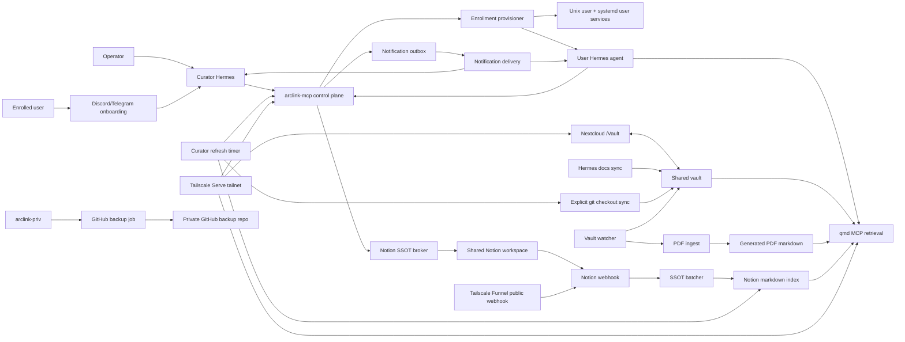

# ArcLink

ArcLink is the self-serve private AI deployment product being built from the
shared-host substrate. It keeps the proven Hermes, qmd, vault, memory,
Nextcloud, code-server, Notion, bot, health, and deploy machinery, then adds
ArcLink product identity, hosted API contracts, Stripe entitlements,
domain-or-Tailscale ingress intent, Chutes-first provider defaults, responsive
user and admin dashboards, fleet operations, rollout records, and a
secret-gated live proof harness.

`deploy.sh` still plays a real role: it is the host bootstrap and operations
entrypoint for the underlying machine. It now exposes three explicit paths:
Sovereign Control Node, Shared Host, and Shared Host Docker. ArcLink's Python
control plane owns product state, provisioning intent, provider gates, admin
actions, and live-proof orchestration.

Use this mental split:

```text
deploy.sh                 host setup, Docker stack, health, repair, upgrades
python/arclink_*.py       SaaS control plane, provisioning intent, executor gates
web/                      ArcLink user/admin dashboard shell
docs/arclink/             product, operations, safety, and live-proof docs
```

Production live proof is intentionally not claimed yet. The no-secret
foundation is implemented and tested; the full live journey is blocked until
real Stripe, Cloudflare, Chutes, Telegram, Discord, and production host
credentials are supplied for domain mode, or real Stripe, Tailscale, Chutes,
Telegram, Discord, and production host credentials are supplied for Tailscale
mode.

## What Ships Today

ArcLink currently ships as an additive product/control-plane layer on top of the
ArcLink runtime. The combined system provides:

- Host bootstrap, Docker install/repair, health, upgrade, and recovery tooling
  through `deploy.sh`.
- A public infrastructure repo plus a nested private `arclink-priv/` repo for
  sensitive runtime state.
- A shared vault on disk, exposed in Nextcloud as `/Vault`.
- qmd collections for authored vault files, PDF-ingested markdown, and indexed
  shared Notion pages.
- One operator-owned Curator Hermes agent.
- One isolated user Hermes agent per enrolled Unix account.
- Telegram and Discord onboarding, approval, user-agent gateway, and operator
  notification flows.
- Chutes, Claude Opus, and OpenAI Codex model onboarding.
- Claude Opus through Claude Code OAuth credentials, not Anthropic API keys.
- Chutes through `https://llm.chutes.ai/v1` as an OpenAI-compatible Hermes
  custom provider.
- Thinking-level selection for agents, with Chutes `:THINKING` model handling
  when enabled.
- Shared Notion SSOT reads and safe writes through an ArcLink broker.
- Vault, skills, plugins, Notion, upgrade, and assigned-work notifications.
- PDF extraction into generated markdown, with optional vision captions.
- Repo sync for explicitly cloned git checkouts inside the vault.
- GitHub backup for `arclink-priv/`.
- Optional per-user Hermes-home backups.
- Optional remote control of a user agent over Tailscale SSH.
- Health, repair, enrollment cleanup, and upgrade tooling.
- ArcLink `ARCLINK_*` config, hosted API, auth/CSRF, Stripe/Cloudflare/Chutes
  fake/live boundaries, public onboarding contracts, dashboards, fleet
  placement, domain/Tailscale ingress, admin action worker, rollouts,
  diagnostics, host readiness, and live-proof evidence tooling.
- A Next.js 15 + Tailwind 4 ArcLink web shell with route smoke tests and
  browser product checks.

The important design choice: agents do not need to rummage around blindly.
They get high-level MCP tools that know the shape of the substrate, while
ArcLink gives operators and customers a cleaner product surface.

## Mental Model

```text
operator
  owns Curator
  approves enrollments
  repairs and upgrades the host

Curator
  handles onboarding
  routes notifications
  keeps vault and Notion context fresh

enrolled user
  gets a Unix account
  gets a private Hermes home
  gets a bot lane and optional remote SSH lane

user agent
  retrieves from qmd
  writes through the Notion SSOT broker
  receives vault/skill/plugin/Notion/work notifications
```

The vault is the durable memory deck. qmd is the fast retrieval engine. Notion
is the shared work surface. Curator is the pit crew.

## Architecture



## Repository Layout

The Shared Host deployed layout is:

```text
/home/arclink/
  arclink/                 # public repo: scripts, units, templates, skills
    arclink-priv/          # private nested repo: config, vault, runtime state
```

The Sovereign Control Node host can also run from a root-owned or operator-owned
checkout such as:

```text
  arclink-priv/            # generated private runtime state
```

The exact host checkout path is less important than keeping the public repo and
private runtime directory together. Control and Docker modes record the chosen host paths in
`arclink-priv/config/docker.env`.

`arclink-priv/` contains the sensitive and living parts:

```text
arclink-priv/
  config/
    arclink.env
  vault/
  published/
  quarto/
  state/
    agents/
    curator/
    nextcloud/
    notion-index/
    pdf-ingest/
    runtime/
```

The public repo ignores `arclink-priv/`. Back up the inner private repo, not
the outer infrastructure repo.

## Host Deployment From Scratch

For ArcLink today, the recommended first host path is Sovereign Control Node
Mode through `deploy.sh`. That makes this machine the product control plane:
website/API onboarding, shared Telegram and Discord bot webhooks, Stripe
checkout/webhook handling, admin/user dashboards, fleet placement, Cloudflare
or Tailscale ingress intent, and provisioning orchestration.

### 1. Prepare The Host

Use a fresh Debian/Ubuntu server or VM with root or sudo access.

Minimum packages:

```bash
apt-get update
apt-get install -y git ca-certificates curl
```

Install Docker Engine with the provider method you trust, then confirm:

```bash
docker --version
docker compose version
```

### 2. Clone ArcLink

Until the dedicated ArcLink repository exists, the working branch is
`arclink` in this repository.

```bash
git clone -b arclink https://github.com/sirouk/arclink.git arclink
cd arclink
```

### 3. Bring Up The Sovereign Control Node

```bash
./deploy.sh control install
./deploy.sh control ports
./deploy.sh control health
./deploy.sh control provision-once
```

`./deploy.sh control install` is idempotent. It bootstraps `arclink-priv/`,
writes `arclink-priv/config/docker.env`, gathers the public product/provider
configuration, builds the app image, starts Docker Compose, records release
state, prints ports, and verifies the control API, web app, MCP, qmd, webhook,
Nextcloud, and job substrate.

### 4. Know What Is Live And What Is Gated

After control install, the host substrate runs the hosted API and web control
center in addition to Nextcloud, qmd MCP, ArcLink MCP, Notion webhook, vault
watch, agent supervisor, health watch, refresh jobs, PDF ingest, memory
synthesis, and supporting jobs from `compose.yaml`.

The SaaS control plane and web shell are present in code, tests, and docs, but
credentialed production proof is still gated. Do not mark the system
launch-live until the explicit Production 12 live run is completed with real
Stripe, Chutes, Telegram, Discord, production host credentials, and the selected
ingress-mode credentials.

### 5. Day-Two Host Commands

```bash
./deploy.sh control health
./deploy.sh control logs [SERVICE]
./deploy.sh control ps
./deploy.sh control upgrade
./deploy.sh docker pins-check
./deploy.sh docker rotate-nextcloud-secrets
```

Use `./deploy.sh install` when you intentionally want Shared Host Mode:
operator-led onboarding, approved enrollments, enrolled Unix users, and shared
host services. Use `./deploy.sh docker install` when you intentionally want the
containerized Shared Host substrate.

## Deployment Paths

ArcLink has three first-class deployment paths. They share `deploy.sh`, health,
repair, upgrade, and recovery vocabulary, but they represent different product
shapes.

| Path | Best for | Command shape | Runtime manager |
| --- | --- | --- | --- |
| **Sovereign Control Node Mode** | Dockerized paid self-serve ArcLink control plane: website/API onboarding, shared bots, Stripe, domain-or-Tailscale ingress intent, fleet placement, provisioning jobs, user/admin dashboards. | `./deploy.sh control install`, `./deploy.sh control health` | Docker Compose control plane |
| **Shared Host Mode** | Operator-led ArcLink installs, Curator approval workflows, enrolled Unix users, shared MCP/QMD/Nextcloud/Notion services, and production host operations. | `./deploy.sh install`, `./deploy.sh upgrade`, `./deploy.sh health` | Linux systemd plus selected containers |
| **Shared Host Docker Mode** | Containerized validation and operation of the operator-led Shared Host substrate, including Curator/enrollment flows and shared services. This is not the paid Sovereign pod control path. | `./deploy.sh docker install`, `./deploy.sh docker health` | Docker Compose shared-host substrate |

The interactive `./deploy.sh` menu first asks which mode you want, then opens
that mode's control center. Sovereign Control Node actions live under the
control menu and are the Dockerized paid-customer pod path. Shared Host actions
live under the Shared Host menu. Shared Host Docker actions live under the
Docker menu and are for operator-led shared services, not Sovereign pods. The
top-level default is Sovereign Control Node Mode. Direct commands that do not
include `control` or `docker`, such as `./deploy.sh install`, use Shared Host
Mode.

## Local Validation

Install focused test and lint dependencies before running ArcLink or onboarding
validation:

```bash
python3 -m pip install -r requirements-dev.txt
```

ArcLink foundation behavior and runbook notes live in:

```text
docs/arclink/foundation.md
docs/arclink/foundation-runbook.md
docs/arclink/live-e2e-secrets-needed.md
```

## Shared Host Mode

Shared Host Mode is the operator-led ArcLink path. It installs and repairs the
live shared-host system, performs operator onboarding/config collection, uses
`sudo` for privileged host setup, manages systemd units, provisions enrolled
Unix users, and drives production upgrades from the configured upstream.

Canonical shared-host installs use this on-host layout:

```text
/home/arclink/
  arclink/                 # public repo
    arclink-priv/          # private nested repo/state; ignored by public git
      config/arclink.env   # live config
      vault/               # shared vault
      state/               # control DB, runtime, agents, indexes, containers
```

Use Shared Host Mode when you want the complete operator-led ArcLink operating
model:
Curator onboarding, per-user Unix accounts, user-level systemd services,
chat gateways, Tailscale Serve/Funnel integration, host health repair, and
idempotent reinstall/upgrade flows.

### Shared Host Requirements

Supported shared-host environments:

- Debian or Ubuntu-style Linux with `apt`, `systemd`, and `loginctl`.
- WSL2 Ubuntu when systemd is enabled.
- An Ubuntu VM.

Not supported as a full host:

- Native macOS.
- Machines without systemd user services.

You can still use helper commands from macOS or another workstation, but the
actual shared-host stack expects Linux system services.

### Shared Host Quick Start

From the repo root:

```bash
./deploy.sh install
```

Common direct modes:

```bash
./deploy.sh install                 # install or repair from this checkout
./deploy.sh upgrade                 # upgrade deployed host from configured upstream
./deploy.sh health                  # full host health check
./deploy.sh curator-setup           # repair Curator only
./deploy.sh notion-ssot             # configure shared Notion
./deploy.sh notion-migrate          # guided migration to a new Notion workspace
./deploy.sh notion-transfer         # back up or restore a Notion page subtree
./deploy.sh enrollment-status
./deploy.sh enrollment-align
./deploy.sh enrollment-reset
./deploy.sh rotate-nextcloud-secrets
./bin/arclink-ctl upgrade check
```

Install asks for the service user, repo paths, org identity fields, Tailscale
and Nextcloud settings, model presets, Notion, deploy keys, private backup
remote, and optional Quarto support. It asks first, then uses `sudo` only for
the steps that need root.

### Shared Host First Install Checklist

Before a serious install, have these ready:

- A Linux host where the operator can use `sudo`.
- A GitHub repo for this public `arclink` codebase.
- A private GitHub repo for `arclink-priv` backup.
- Tailscale on the host if you want tailnet-only browser, MCP, and remote
  agent access.
- A Discord or Telegram operator channel if you want chat approvals.
- Optional Notion internal integration token for the shared SSOT workspace.
- Optional Chutes API key for Chutes-powered agents.
- Claude account access for Claude Code OAuth lanes.
- OpenAI/Codex sign-in if you want Codex lanes.

## Shared Host Docker Path

Shared Host Docker is the Docker Compose path for the inherited operator-led
substrate. It is designed for portable operation on servers, laptops, homelab
machines, org evaluation boxes, and container-first environments where host
systemd user services are not the runtime manager.

Use Shared Host Docker when you want the ArcLink shared-host substrate: ArcLink MCP, qmd
MCP, Notion webhook, Nextcloud, Postgres, Redis, vault watching, PDF ingest,
docs sync,
notification delivery, curator refresh, qmd refresh, enrolled-agent
supervision, and Docker-native health watch containers under Docker Compose.

Optional Docker profiles cover Curator chat services, Quarto rendering, and
backup jobs when their credentials/config are present. Docker install starts the
Curator profile services after operator setup when the configured credentials
allow them to run. Enrolled agents run under the Docker agent supervisor instead
of per-user systemd units: refresh, Hermes gateway, dashboard, authenticated
dashboard proxy, cron ticks, and code-server workspace processes are reconciled
from the same control-plane state.

### Containerized Requirements

- Docker with `docker compose`.
- Bash and Python 3 on the machine running the wrapper scripts.
- No Podman requirement for Docker mode.

## Sovereign Control Node Mode

Sovereign Control Node Mode is the product control-plane path backed by Docker
Compose. The host becomes the coordinator for self-serve users: web/API,
Telegram, and Discord onboarding; Stripe checkout/webhooks; fleet placement;
per-user pod intent; Tailscale or Cloudflare/domain ingress intent; health; and
user/admin dashboards. Individual deployments are treated as Sovereign pods
with their own runtime state, secrets, health, and product configuration. This
is also the future collaboration model described in `FUTURE_SHARED_ARCLINK.md`.

### Sovereign Control Node Quick Start

From the repo root:

```bash
./deploy.sh control install
./deploy.sh control ports
./deploy.sh control health
```

Docker bootstrap writes local runtime config under
`arclink-priv/config/docker.env`, generates local Postgres and Nextcloud
secrets for fresh installs, and assigns a coherent available host port block.
The selected ports are persisted in `arclink-priv/state/docker/ports.json`.
Use the wrapper commands for normal operation; raw Compose intentionally refuses
to start until the generated secret env values exist.

Sovereign Control Node install asks the public product questions: ingress mode
(`tailscale` or `domain`), control API/web ports, provisioner enablement,
executor adapter (`ssh` for fleet hosts, `local` for a starter single-host
deployment, `fake` for dry validation), Stripe price and webhook settings,
Chutes owner key, and shared Telegram/Discord bot credentials. In `domain`
mode it also asks for the root domain, Cloudflare DNS edge target, API token,
and zone ID. In `tailscale` mode it asks for the node's Tailscale DNS name,
uses `:443` by default for the public control/Notion path, and does not require
Cloudflare DNS credentials. Missing provider credentials are allowed during
bootstrap, but live E2E remains gated until they are present.

Stripe setup should use a selected-event webhook destination, not "All events".
Point Stripe at `https://<control-host>/api/v1/webhooks/stripe` and select:
`checkout.session.completed`, `customer.subscription.created`,
`customer.subscription.updated`, `customer.subscription.deleted`,
`invoice.payment_succeeded`, `invoice.paid`, and `invoice.payment_failed`.
Copy the endpoint signing secret into `STRIPE_WEBHOOK_SECRET` through
`./deploy.sh control reconfigure`. Keep the signing secret in
`arclink-priv/config/docker.env` only. The full operator walkthrough is in
`docs/arclink/operator-stripe-webhook.md`.

Tailscale mode keeps the control node application Dockerized. `deploy.sh`
brings up the Docker stack, then uses the host Tailscale CLI only as the
network edge to publish the Dockerized web, API, and Notion webhook services.
Per-user pod URLs default to path-based routes under the worker's Tailscale
FQDN, for example `https://worker.tailnet.ts.net/u/<prefix>/files`. A
`subdomain` strategy exists for environments that can really resolve and
certificate sub-subdomains under a Tailscale name, but `path` is the safe
default.

Each Sovereign pod also reserves its own Notion callback surface in provisioning
intent. In domain mode that is `https://u-<prefix>.<base-domain>/notion/webhook`;
in Tailscale path mode that is
`https://<worker-tailnet-name>/u/<prefix>/notion/webhook`. The shared host's
operator Notion Funnel is separate and should not be confused with customer pod
Notion connections.

When enabled, `control-provisioner` runs
`python/arclink_sovereign_worker.py`: it claims paid `provisioning_ready`
deployments, places them onto registered fleet hosts, applies Cloudflare DNS in
domain mode or skips DNS in Tailscale mode, materializes per-pod Docker Compose
bundles, starts them locally or over SSH, and records health/audit/handoff
state. For SSH fleet execution, `deploy.sh control install` generates or reuses
`arclink-priv/secrets/ssh/id_ed25519`, prints the public key, and asks you to
confirm it has been added to the target node's `authorized_keys`. When you
register the current machine as the first local worker, deploy can also create
or repair an `arclink` Unix user, install that same key into
`~arclink/.ssh/authorized_keys`, prepare `/arcdata/deployments`, grant Docker
group access when available, and run an `ssh -i ... arclink@localhost true`
smoke test. That keeps localhost and later Hetzner workers on the same fleet
contract instead of having a special one-off local path.

Control-node details live in
`docs/arclink/sovereign-control-node.md`.

## Shared Host Docker Mode

Shared Host Docker Mode is the containerized operator-led shared substrate. It
runs the shared-host services and Curator/enrollment machinery inside Docker
Compose for validation, repair, and container-native operation. It does not ask
for Cloudflare-vs-Tailscale Sovereign pod ingress because it is not the paid
customer pod control node.

### Shared Host Docker Quick Start

```bash
./deploy.sh docker install
./deploy.sh docker ports
./deploy.sh docker health
```

Shared Host Docker install asks the operator-facing configuration questions,
writes `arclink-priv/config/docker.env`, applies the private operating profile
when present, records release state, runs strict Docker health, and runs the
live agent MCP tool smoke so the containerized path stays aligned with the
Shared Host operator contract. It can also run the Curator setup flow from the
container so the operator gets the same model, channel, and notification
questions as a Shared Host install. Set `ARCLINK_DOCKER_SKIP_OPERATOR_CONFIG=1`
or `ARCLINK_DOCKER_SKIP_CURATOR_SETUP=1` for scripted installs that should skip
those interactive phases.

Docker agent homes are stored under `arclink-priv/state/docker/users/`, so
container recreation does not erase enrolled-agent Hermes homes. Agent dashboard
and code-server ports are published one surface at a time from the access-state
ports ArcLink allocates, so a single occupied port cannot block the whole stack.

The Docker path keeps the same operator vocabulary for container-native work:

```bash
./deploy.sh docker notion-ssot
./deploy.sh docker notion-migrate
./deploy.sh docker notion-transfer
./deploy.sh docker enrollment-status
./deploy.sh docker enrollment-trace --unix-user <user>
./deploy.sh docker enrollment-align
./deploy.sh docker enrollment-reset --unix-user <user>
./deploy.sh docker curator-setup
./deploy.sh docker rotate-nextcloud-secrets
./deploy.sh docker reconcile
./deploy.sh docker live-smoke
./deploy.sh docker pins-check
```

Pinned-component Docker upgrades re-enter `./deploy.sh docker upgrade` after
the pin bump and load upstream push/deploy-key settings from the Docker runtime
config. In the interactive flow, Shared Host Docker commands stem from the
Shared Host Docker control center. Shared Host commands remain in Shared Host
Mode unless the direct command includes `docker`.

The Docker submenu is available with:

```bash
./deploy.sh docker
```

More detail lives in `docs/docker.md`.

## Deploy Keys

ArcLink intentionally keeps deploy keys separate:

- **ArcLink upstream deploy key**: read/write key for operator or agent code
  pushes to the public `arclink` repo.
- **`arclink-priv` backup deploy key**: read/write key for private host
  backup.
- **Per-user agent backup deploy key**: read/write key for that user's private
  Hermes-home backup repo.

Do not reuse those keys. Different blast radius, different job.

During `deploy.sh install`, ArcLink can generate the upstream key, print the
public key, print the GitHub deploy-key settings URL, and verify read plus
dry-run write access once you enable **Allow write access** in GitHub.

For `arclink-priv`, health checks refuse unsafe backup shapes. A backup target
should be private.

## Upgrades

Use:

```bash
./deploy.sh upgrade
```

Upgrade fetches the configured upstream repo and branch from `arclink.env`,
syncs the deployed public repo, refreshes shared services, repairs Curator,
records the release state, and ends with health.

Curator also runs:

```bash
./bin/arclink-ctl upgrade check
```

on a timer. It can notify the operator when upstream has moved. If the
operator deploy key is owned by a human account, the service-side upgrade
check can fall back to public GitHub HTTPS for read-only status checks. Private
upstreams still require service-readable credentials.

## User Onboarding

Users normally start in a Discord or Telegram DM with Curator:

1. Curator asks for name, purpose, Unix username, bot name, model provider,
   model id, and thinking level.
2. The operator approves the onboarding request.
3. ArcLink creates the Unix user, enables linger, and provisions the user
   Hermes home.
4. The user gives Curator their own bot token for the same platform.
5. Curator wires the user's agent gateway. For Discord, ArcLink opens the
   user-agent bot DM directly by Discord user id and uses that DM as the home
   channel; the user does not need to add the bot to a server first.
   For Telegram, Curator points the user at the `@botname` handle so they can
   tap it and press Start, which is required before Telegram lets the bot chat.
6. Curator offers private agent backup setup, then shared Notion identity
   verification when configured, then remote SSH control setup.

The public curl bootstrap also exists for laptop-originated enrollment:

```bash
curl -fsSL https://raw.githubusercontent.com/example/arclink/main/init.sh \
  | bash -s -- agent --target-host arclink.your-tailnet.ts.net
```

That submits a tailnet-scoped enrollment request. The host-side install still
happens only after operator approval.

## Model Provider Onboarding

The user-facing provider list is intentionally small and practical:

- **Org-provided**: appears first when deploy config includes
  `ARCLINK_ORG_PROVIDER_ENABLED=1` plus an org provider credential. Users do
  not provide a model or provider credential; Curator shows the org provider
  and default model, then explains how to change models later.
- **Chutes model provider**: first in the list when no org default is configured. Curator asks
  for the API key, model id, and
  thinking level. Hermes is configured as a custom OpenAI-compatible provider
  using `https://llm.chutes.ai/v1`.
- **Claude Opus**: uses Claude Code OAuth. Curator gives the user the Claude
  authorization URL, the user completes the browser flow, and ArcLink exchanges
  the callback code privately. ArcLink seeds refreshable Claude Code
  credentials for Hermes. It does not ask for an Anthropic API key or a setup
  token in chat.
- **OpenAI Codex**: uses the Codex device sign-in flow.

Default provider targets and suggested models are declared in
`config/model-providers.yaml`. Current defaults are Chutes
`moonshotai/Kimi-K2.6-TEE`, Claude `claude-opus-4-7`, and Codex `gpt-5.5`.
Legacy alias presets such as `openai:codex`, `anthropic:claude-opus`, and
`chutes:model-router` resolve through that file so upgraded hosts pick up the
current defaults.

Thinking levels are normalized to Hermes' agent config. For Chutes, any level
except `none` enables the Chutes thinking model form when the selected model
supports it.

## User Agent Surfaces

An enrolled user gets:

- A Unix account on the shared host.
- A private `HERMES_HOME` under `~/.local/share/arclink-agent/hermes-home`.
- A chat bot lane on Discord or Telegram.
- User systemd services for refresh, gateway, dashboard, and code workspace
  when enabled.
- Hermes dashboard plugins for `ArcLink Drive`, `ArcLink Code`, and the
  managed-pty `ArcLink Terminal`, so native workspace surfaces appear in the
  Hermes sidebar without patching Hermes core.
- A `~/ArcLink` symlink to the shared vault for VS Code / code-server file
  explorer convenience.
- `$HERMES_HOME/ArcLink` and `$HERMES_HOME/Vault` symlinks for agent-local
  discovery and compatibility with existing instructions.
- Optional Nextcloud user access.
- Optional private agent backup to a user-owned GitHub repo. Curator asks for a
  private `owner/repo` path, generates a per-user deploy key, refuses public
  repos, and activates the 4h Hermes cron backup job only after GitHub read
  plus dry-run write access verifies.
- Discord completion handoff with a visual confirmation code: after Curator
  sends the dashboard and workspace links, the user-agent bot DMs the user
  directly with the same code. Operators can retry that outreach from the
  configured operator channel with `/retry_contact <unixusername|discordname>`
  or from the host with `arclink-ctl onboarding retry-contact`; retries reuse
  the stored Curator confirmation code and refuse to send if that code is
  missing or mismatched. Discord onboarding users can also DM Curator
  `/retry-contact` to retry their own agent-bot DM with the same code.
- Optional remote SSH control over Tailscale using a user-provided public key.

Vault shortcuts refuse to overwrite a real directory. Stale symlinks are
repaired; real user data is not bulldozed.

## Vaults And Knowledge

The vault is a normal directory tree. The seeded folders are a starting point,
not a required taxonomy, and organizations can keep the tree as flat or as
domain-specific as feels natural. `.vault` metadata files opt a directory into
named subscription and notification behavior; plain directories are still
valid vault content and remain searchable through qmd.

```text
vault/
  Team Brief.md
  Clients/
    Acme/
      launch-notes.md
  Projects/
    .vault
    roadmap.md
  Agents_KB/
    .vault
    hermes-agent-docs/
  Repos/
    .vault
```

Vault rules:

- `.vault` files define name, purpose, owner, category, and default
  subscription behavior.
- Directories without `.vault` are fine. They are not subscription lanes, but
  qmd still indexes their markdown and text files.
- Nested `.vault` roots are invalid in v1 and appear as health warnings.
- Retrieval is available to approved agents through MCP/qmd.
- Shared Hermes skill repos under `Agents_Skills/*/skills` are also wired into
  each Curator/user-agent `skills.external_dirs` during install/refresh, so
  org-published skills can show up in Hermes `skills_list` while remaining
  shared read-only vault assets.
- Subscriptions control plugin-managed fanout and notifications, not raw
  retrieval permission.
- Vault notifications are category-aware: skills, plugins, Hermes docs, and
  general project updates get different copy.
- It is safe to move or rename normal vault files. qmd source paths change, so
  old exact file refs may go stale, but search self-heals after the watcher or
  scheduled refresh reindexes the tree.
- Editing a `.vault` file reloads the catalog through the watcher. Moving an
  entire `.vault`-marked directory is also reconciled by the hourly Curator
  refresh even if no metadata file write event is observed.

## Operating Profile

Operators can predefine people, roles, groups/teams, household circles,
relationships, responsibilities, agent delegation boundaries, and reusable
agent lineage through a structured operating profile. The command and private
file still use the compatibility name `org-profile`, but the profile can model
a solo operator, family/household, project collective, organization, or hybrid.
The shipped repo includes the schema, a compact fictional example, a full
fictional ultimate ingestion example, an interactive private profile builder,
and an `arclink-ctl org-profile` build, validate, preview, apply, and doctor
workflow. ArcLink still seeds `SOUL.md` and
`state/arclink-identity-context.json` from onboarding/session data, then
overlays applied profile slices when a profile match exists.

The populated private file belongs at:

```text
arclink-priv/config/org-profile.yaml
```

Operator-specific source repo manifests and optional extra MCP rails are private
configuration too:

```text
arclink-priv/config/team-resources.tsv
ARCLINK_EXTRA_MCP_NAME
ARCLINK_EXTRA_MCP_LABEL
ARCLINK_EXTRA_MCP_URL
```

`config/team-resources.example.tsv` shows the manifest format with fictional
repos. `bin/clone-team-resources.sh` reads the private manifest, clones or
updates those repos into the shared vault, and writes `.arclink-source.json`
sidecars so qmd can index them.

The public repo includes a schema and fictional example:

```text
config/org-profile.schema.json
config/org-profile.example.yaml
config/org-profile.ultimate.example.yaml
docs/org-profile.md
```

The profile pipeline feeds agent `SOUL.md`, identity state, plugin-managed context,
control-plane rows, and a sanitized vault render so agents understand who they
serve, what that human owns, who the other people are, which workflows,
automations, and benchmarks matter, and where the agent must ask instead of
act. Markdown files can support context, but they should not silently define
accountability or approval.

During onboarding, Curator can offer safe profile-person choices from unapplied
roster entries when the applied profile privacy policy allows it. That
user-selected link is stored separately from the bot name and Unix account name,
shown to the operator as unverified, and used only to orient the agent through
plugin-managed context and the `SOUL.md` overlay after normal approval.

Profiles can also carry practical non-secret identity and source pointers such
as Discord handles, GitHub usernames, person-specific repos, and shared repo
maps. Numeric Discord ids are optional when available; handles are easier to
collect during onboarding. Repo URLs and permission expectations belong in the
profile, while deploy keys, tokens, and credentials stay in private state.

Typical operator flow:

```bash
./bin/arclink-ctl org-profile build
./bin/arclink-ctl org-profile validate
./bin/arclink-ctl org-profile preview
./bin/arclink-ctl org-profile apply --yes
./bin/arclink-ctl org-profile doctor
```

`./deploy.sh install` asks whether to launch the interactive builder once the
private path is known, and install/upgrade apply the private profile when it is
present so production agents stay aligned with the operator-owned contract.

## qmd Retrieval

ArcLink indexes three active knowledge lanes:

- `vault`: authored markdown/text files anywhere under the shared vault root.
- `vault-pdf-ingest`: generated markdown sidecars created from PDFs.
- `notion-shared`: indexed shared Notion pages.

Agents should prefer ArcLink MCP wrappers over raw qmd calls:

```text
knowledge.search-and-fetch   # best first move when source is unclear
vault.search-and-fetch       # vault + PDF body retrieval
vault.fetch                  # exact qmd hit/docid fetch
notion.search-and-fetch      # shared Notion discovery + live fetch
notion.fetch                 # exact Notion page/database/data source fetch
ssot.read                    # scoped shared database reads
ssot.write                   # insert/update/append/create pages or databases through brokered writes
ssot.status                  # follow queued writes
```

Those wrappers normalize qmd resource shapes, include PDF-ingest by default,
bound fetch sizes, and fall back from vector+lex search to lex-only when a
fast retrieval path needs to stay alive.

`arclink-memory-synth.timer` is a cached second-stage sensemaking lane. When an
OpenAI-compatible vision/chat model is configured through
`ARCLINK_MEMORY_SYNTH_*` or the existing `PDF_VISION_*` settings, it periodically
summarizes bounded vault folders and indexed Notion areas into compact semantic
cards. The synthesis prompt is domain-neutral: it is meant to work for families,
creators, small businesses, communities, research groups, and larger
organizations. Vault cards include bounded media, office, data, design, archive,
PDF, and text inventories as retrieval cues, while repo inventories stay shallow
so a source tree does not explode the prompt. Cache fingerprints are kept out of
the model prompt and represented as full-source hashes, so freshness checks do
not spend tokens or miss ordinary moves, renames, edits, and deletions outside
the compact prompt sample. Cards are stored in
the control-plane database and rendered into `[managed:recall-stubs]` by the
managed-context plugin. The vault watcher requests an asynchronous synthesis
pass after vault refresh batches, while the 30-minute timer remains the backstop.
Per-agent recall stubs prioritize subscribed vault lanes before falling back to
newer global cards. The service skips unchanged sources, keeps output short, and
treats every card as a retrieval cue rather than evidence.

## PDFs And Files

qmd indexes text-like files directly:

```text
*.md, *.markdown, *.mdx, *.txt, *.text
```

The `vault` qmd collection is rooted at `VAULT_DIR`, not at a fixed child like
`Repos/` or `Projects/`. Moving a file within the vault removes the old source
path and adds the new one on the next qmd update. The live watcher triggers on
creates, deletes, moves, and text-file writes; the scheduled qmd timer also
runs every 15 minutes as a backstop.

PDFs are reconciled by ArcLink before qmd refresh:

- `pdf-ingest` extracts text with the configured backend.
- Generated markdown lands under `state/pdf-ingest/markdown`.
- qmd indexes that generated markdown in `vault-pdf-ingest`.
- Optional vision captioning can add page-image context for the first N pages.
- The authored PDF remains in the vault; the generated markdown is the
  retrieval sidecar.

That means a dropped PDF becomes searchable even when qmd itself is only
indexing text collections. Moving or deleting PDFs is reconciled through the
PDF manifest and generated sidecar cleanup on the next watcher/timer pass.

## Explicit Repo Sync

ArcLink does not crawl every GitHub URL in the vault.

The repo-sync rail now means:

1. Clone a repo into the vault yourself.
2. ArcLink discovers real `.git/` checkouts.
3. On refresh, it hard-syncs each checkout to `origin/<current-branch>`.

The sync behavior is intentionally mirror-like:

```bash
git fetch --prune origin <branch>
git reset --hard origin/<branch>
git clean -fdx
```

Local commits and dirty edits are overwritten. Untracked files are removed,
including gitignored build caches. Pinned ArcLink sync trees such as
`Agents_KB/hermes-agent-docs/` are skipped via `.arclink-source.json`.

`Repos/` is only the default library convention. Repo sync walks the whole
vault, so `Clients/Acme/api`, `Code/demo`, or any other real checkout under
`VAULT_DIR` is discovered the same way. If a checkout is moved within the
vault, the next Curator refresh discovers its new path. If it is moved out of
the vault, qmd and repo sync stop tending it.

## Hermes Docs

ArcLink syncs Hermes documentation into this default location:

```text
vault/Agents_KB/hermes-agent-docs/
```

That sync is pinned to the same `ARCLINK_HERMES_AGENT_REF` as the shared
runtime by default. Agents can search their own operating documentation
without reading docs for a Hermes version they are not running. Operators can
override `ARCLINK_HERMES_DOCS_VAULT_DIR` if their vault uses a different docs
layout.

## Notion SSOT

Configure the shared Notion workspace with:

```bash
./deploy.sh notion-ssot
```

To move ArcLink to a different Notion workspace, use:

```bash
./deploy.sh notion-migrate
```

The migration guide backs up private config and SQLite state, walks the operator
through creating the new internal integration and webhook subscription, archives
old workspace-specific caches and pending writes, clears user Notion identity
verification so users can re-verify, and runs a fresh `notion-shared` index
sync.

To copy a page subtree between Notion workspaces without changing ArcLink's
live SSOT configuration, use:

```bash
./deploy.sh notion-transfer
```

That guided flow asks for source and destination token files, a source root
page URL/ID, and a destination parent or root page URL/ID. It writes backups under
`arclink-priv/state/notion-transfer/` and always runs a restore dry-run before
allowing writes.

The shared Notion lane uses one operator-managed internal integration, not
per-user OAuth. ArcLink verifies each user's local Notion identity through a
self-serve claim page, then uses that verified identity to scope reads and
writes.

Notion write behavior:

- `insert`, `update`, `append`, `create_page`, and `create_database` are supported.
- `create_page` creates shared pages or list pages under the configured
  ArcLink root page or an explicit target page so the new page inherits that
  parent page's organization access.
- `create_database` creates shared databases under the configured ArcLink root
  page or an explicit target page so the new database inherits that parent
  page's organization access.
- `archive`, `delete`, `trash`, and destructive operations are rejected.
- Payload-level Notion parents are not accepted for shared page/database creation;
  agents should not use personal Notion MCP or workspace-level creation for
  org SSOT objects, because those can land in a user's Private section.
- Page and append block batches are bounded to Notion's 100 child-block request
  limit and malformed block objects are rejected before calling the API.
- Writes inside a verified user's lane can apply immediately.
- Out-of-scope writes queue for approval instead of pretending they worked.
- Successful page writes return receipt fields such as URL/page id.
- Notion's native edit history shows the integration; ArcLink keeps local
  attribution and audit context, and can stamp `Changed By` when the database
  exposes that people property.

For broad knowledge questions, agents should use `notion.search-and-fetch` or
`knowledge.search-and-fetch`. For structured work rows owned or assigned to a
verified user, use `ssot.read` and `ssot.write`.

## Notifications

ArcLink is designed to nudge agents without turning them into notification
confetti.

Event lanes include:

- Vault content updates.
- Skill updates.
- Plugin updates.
- Hermes docs updates.
- Shared Notion webhook changes.
- SSOT digests, compact `[managed:vault-landmarks]` /
  `[managed:notion-landmarks]`, synthesis-backed `[managed:recall-stubs]`, and
  `[managed:today-plate]`.
- Pending write approvals.
- Assigned or due work.
- Host upgrade notices.
- Backup and health problems.

Curator delivers ambient context through plugin-managed context and hot events
through notification delivery. Agents should verify live state before writing
shared systems.

`arclink-health-watch.timer` runs the full host health check on a 15-minute
cadence and queues an operator notification when failures appear or change. It
dedupes by failure fingerprint and sends a recovery notice when the health
check clears.

## Security Boundaries

The default posture is local-first and tailnet-first:

- Core MCP services bind to loopback.
- Tailscale Serve publishes selected routes when enabled.
- Funnel is only used for the explicitly configured public webhook route.
- Shared Notion deletes are blocked at the broker.
- Public repo code and private `arclink-priv` state are separate.
- Backup deploy keys are separate from code-push deploy keys.
- User agents get isolated Unix accounts and private Hermes homes.
- User agents authenticate to ArcLink MCP with a per-agent bootstrap token
  stored in their private Hermes home; the managed-context plugin injects it
  automatically so agents do not expose or hand-type it. Shared Host
  realignment and Shared Host Docker agent supervision both validate and repair
  that token path idempotently.
- User-facing write access goes through scoped broker rails, not raw Notion
  access.
- Health checks flag placeholder secrets, missing keys, inaccessible ports,
  vault metadata problems, and stale upgrade state.

## Recovery And Operations

Curator is important, but the system does not depend on chat being healthy.

Recovery surfaces:

```bash
./bin/curator-tui.sh
./bin/arclink-ctl
./deploy.sh health
./deploy.sh curator-setup
./deploy.sh enrollment-align
./deploy.sh enrollment-reset
```

Useful operator commands:

```bash
./bin/arclink-ctl onboarding list
./bin/arclink-ctl onboarding approve <session-id>
./bin/arclink-ctl onboarding deny <session-id>
./bin/arclink-ctl onboarding retry-contact <unixusername|discordname>
./bin/arclink-ctl provision list
./bin/arclink-ctl provision retry <request-id>
./bin/arclink-ctl agent list
./bin/arclink-ctl agent show <agent-id>
./bin/arclink-ctl vault list
./bin/arclink-ctl vault reload-defs
./bin/arclink-ctl upgrade check
```

Telegram bot command menus use Telegram-compatible underscores for multiword
commands, such as `/setup_backup`, `/verify_notion`, `/ssh_key`, and
operator-only `/retry_contact`. Operators can also use `/upgrade` in the
configured Curator operator channel to queue an idempotent host upgrade/repair.
Typed hyphen aliases continue to work when sent as plain messages.
Discord app commands include `/upgrade` and `/retry-contact`; `/retry-contact`
accepts a target in the operator channel, while in an onboarding DM it retries
that user's own Discord agent-bot handoff.

For deliberate cleanup and re-testing of a user lane:

```bash
./deploy.sh enrollment-reset
```

That can remove the Unix user, user services, onboarding sessions,
auto-provision rows, notification rows, Nextcloud user, and archived state
when requested and confirmed.

## Manual Components

Most operators should use `deploy.sh`, but the pieces are intentionally plain:

- `bin/bootstrap-system.sh`: root/system packages and directories.
- `bin/bootstrap-userland.sh`: Hermes runtime, qmd, private repo scaffolding.
- `bin/bootstrap-curator.sh`: Curator bootstrap and repair.
- `bin/install-system-services.sh`: root-owned timers/services.
- `bin/install-user-services.sh`: service-user timers/services.
- `bin/install-agent-user-services.sh`: per-user agent services.
- `bin/refresh-agent-install.sh`: repair a user's Hermes install and links.
- `bin/migrate-hermes-config.sh`: noninteractive Hermes config schema
  migration for managed Curator and user-agent homes.
- `bin/vault-watch.sh`: filesystem watcher for vault updates.
- `bin/pdf-ingest.sh`: PDF-to-markdown reconciliation.
- `bin/sync-hermes-docs-into-vault.sh`: pinned Hermes docs sync.
- `bin/vault-repo-sync.sh`: explicit local `.git/` checkout hard-sync.
- `bin/backup-to-github.sh`: `arclink-priv` backup.
- `bin/health-watch.sh`: scheduled health checks with deduped operator alerts.
- `bin/configure-agent-backup.sh`: per-user Hermes-home backup setup and
  deploy-key verification fallback outside Curator.
- `bin/setup-remote-hermes-client.sh`: remote Hermes client helper that creates a local `hermes-<org>-remote-<user>` wrapper.
- `bin/arclink-ctl`: operator CLI.

## Day Two Checklist

After install:

1. Run `./deploy.sh health`.
2. Confirm `Summary: ... 0 warn, 0 fail`.
3. Configure Notion with `./deploy.sh notion-ssot` if you want shared SSOT.
4. Add the `arclink-priv` backup deploy key to a private repo.
5. Enroll a test user from Discord or Telegram.
6. Ask the agent to create a harmless Notion page.
7. Ask the agent to refuse a delete request.
8. Drop a markdown file and a PDF into `/Vault`.
9. Confirm `knowledge.search-and-fetch` can retrieve both.
10. Clone a docs repo anywhere under the vault if you want it mirrored locally;
    `vault/Repos/` is the default convention, not a requirement.

## ArcLink: Self-Serve AI Deployment SaaS

ArcLink is the Chutes-first self-serve AI deployment product built on top of
ArcLink's Shared Host and Sovereign Control Node substrates. It adds commercial SaaS
primitives while preserving the existing ArcLink deploy, onboarding, Hermes,
qmd, vault, memory, Notion, and service-health paths.

ArcLink owns:

- Product identity and `ARCLINK_*` configuration (`python/arclink_product.py`).
- 22 `arclink_*` database tables in `python/arclink_control.py`.
- Stripe entitlement interpretation (`python/arclink_entitlements.py`).
- Hostname, DNS drift, and Traefik intent (`python/arclink_ingress.py`).
- Nextcloud isolation and SSH access strategy (`python/arclink_access.py`).
- No-secret provisioning dry-run intent (`python/arclink_provisioning.py`).
- Guarded mutating executor boundary (`python/arclink_executor.py`).
- Fleet registry and placement (`python/arclink_fleet.py`).
- Admin action worker (`python/arclink_action_worker.py`).
- Rollout/rollback records (`python/arclink_rollout.py`).
- Public onboarding session contracts (`python/arclink_onboarding.py`).
- User/admin dashboard read models (`python/arclink_dashboard.py`).
- API/auth boundary with hashed sessions and CSRF (`python/arclink_api_auth.py`).
- Hosted WSGI API under `/api/v1` (`python/arclink_hosted_api.py`).
- Local no-secret product surface prototype (`python/arclink_product_surface.py`).
- Public Telegram/Discord bot skeletons (`python/arclink_public_bots.py`).
- Telegram and Discord runtime adapters (`python/arclink_telegram.py`,
  `python/arclink_discord.py`).
- Host readiness, diagnostics, live journey, evidence, and live runner modules.
- Chutes catalog and adapter contracts (`python/arclink_chutes.py`,
  `python/arclink_adapters.py`).
- Next.js/Tailwind web app in `web/` for the ArcLink landing, onboarding, user
  dashboard, and admin dashboard.

### ArcLink Current Status

The foundation is additive and no-secret testable. The current codebase has
non-external coverage for Production 1-11 and Production 13-16 in
`research/RALPHIE_PRODUCTION_GRADE_STEERING.md`. The executor boundary fails
closed by default, fake adapters prove contract behavior, and the live proof
runner can execute once credentials exist.

Production 12 is the remaining external gate: real Stripe, Chutes, Telegram,
Discord, production host credentials, and the selected ingress-mode credentials
are required before ArcLink can be claimed live-proven end to end.

Detailed ArcLink documentation:

```text
docs/arclink/foundation.md           # behavior notes and config
docs/arclink/foundation-runbook.md   # assumptions, ownership, runbook, repair
docs/arclink/architecture.md         # module map and data flow
docs/arclink/operations-runbook.md   # host operations, health, scale ops
docs/arclink/brand-system.md         # visual identity and voice
docs/arclink/sovereign-control-node.md # control-node deploy and logic trace
docs/arclink/live-e2e-secrets-needed.md  # credential checklist for live testing
```

## Project Posture

ArcLink is meant to supercharge a team, not bury it in ceremony.

The right outcome is:

- Humans can drop files, PDFs, docs repos, and Notion work into familiar
  places.
- Agents can find the right context quickly.
- Writes are useful but bounded.
- Operators can see what happened and repair it.
- The system feels smooth when it works and honest when it cannot.

If something is clunky, it is a bug or a design debt. The whole point of
ArcLink is to make the sharp machinery feel like a calm room people can work
inside.
