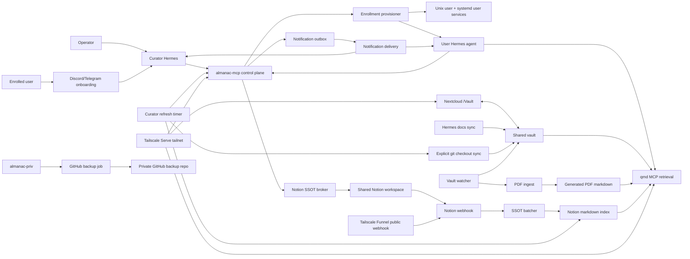

# Almanac

Almanac is a shared-host operating layer for Hermes agents.

It gives an operator one steady Curator agent, gives each enrolled user their
own isolated Hermes lane, and keeps everyone pointed at the same living
knowledge base: files in the vault, PDF-derived notes, synced documentation,
and shared Notion context.

The vibe is a control room, not a toy box. Almanac should feel calm, useful,
and a little magical because the boring parts are handled correctly: Unix
accounts, service repair, deploy keys, qmd indexing, Notion guardrails,
backups, onboarding, and recovery paths.

## What Ships Today

Almanac currently provisions and manages:

- A public infrastructure repo plus a nested private `almanac-priv/` repo.
- A shared vault on disk, exposed in Nextcloud as `/Vault`.
- qmd collections for authored vault files, PDF-ingested markdown, and indexed
  shared Notion pages.
- One operator-owned Curator Hermes agent.
- One isolated user Hermes agent per enrolled Unix account.
- Telegram and Discord onboarding, approval, user-agent gateway, and operator
  notification flows.
- Chutes, Claude Opus, and OpenAI Codex model onboarding.
- Claude Opus through Claude Code OAuth credentials, not Anthropic API keys.
- Chutes through `https://llm.chutes.ai/v1` as an OpenAI-compatible Hermes
  custom provider.
- Thinking-level selection for agents, with Chutes `:THINKING` model handling
  when enabled.
- Shared Notion SSOT reads and safe writes through an Almanac broker.
- Vault, skills, plugins, Notion, upgrade, and assigned-work notifications.
- PDF extraction into generated markdown, with optional vision captions.
- Repo sync for explicitly cloned git checkouts inside the vault.
- GitHub backup for `almanac-priv/`.
- Optional per-user Hermes-home backups.
- Optional remote control of a user agent over Tailscale SSH.
- Health, repair, enrollment cleanup, and upgrade tooling.

The important design choice: agents do not need to rummage around blindly.
They get high-level MCP tools that know the shape of Almanac.

## Mental Model

```text
operator
  owns Curator
  approves enrollments
  repairs and upgrades the host

Curator
  handles onboarding
  routes notifications
  keeps vault and Notion context fresh

enrolled user
  gets a Unix account
  gets a private Hermes home
  gets a bot lane and optional remote SSH lane

user agent
  retrieves from qmd
  writes through the Notion SSOT broker
  receives vault/skill/plugin/Notion/work notifications
```

The vault is the durable memory deck. qmd is the fast retrieval engine. Notion
is the shared work surface. Curator is the pit crew.

## Architecture



## Repository Layout

The intended deployed layout is:

```text
/home/almanac/
  almanac/                 # public repo: scripts, units, templates, skills
    almanac-priv/          # private nested repo: config, vault, runtime state
```

`almanac-priv/` contains the sensitive and living parts:

```text
almanac-priv/
  config/
    almanac.env
  vault/
  published/
  quarto/
  state/
    agents/
    curator/
    nextcloud/
    notion-index/
    pdf-ingest/
    runtime/
```

The public repo ignores `almanac-priv/`. Back up the inner private repo, not
the outer infrastructure repo.

## Deployment Paths

Almanac has two deployment paths. They share the same repository and the same
operator control center, but they do not mean the same thing.

| Path | Best for | Command shape | Runtime manager |
| --- | --- | --- | --- |
| **Baremetal** | Full live shared-host installs, operator onboarding, enrolled Unix users, systemd user services, production upgrades. | `./deploy.sh install`, `./deploy.sh upgrade`, `./deploy.sh health` | Linux systemd plus selected containers |
| **Containerized** | Portable Docker installs for individuals, families, org pilots, homelabs, local validation, and container-first operation. | `./deploy.sh docker install`, `./deploy.sh docker health` | Docker Compose |

If a command does not include the word `docker`, it uses the baremetal path.
Docker is always explicit under `./deploy.sh docker ...`.

## Baremetal Path

Baremetal is the original full operator path. It installs and repairs the live
shared-host system, performs operator onboarding/config collection, uses `sudo`
for privileged host setup, manages systemd units, provisions enrolled Unix
users, and drives production upgrades from the configured upstream.

Use baremetal when you want the complete current Almanac operating model:
Curator onboarding, per-user Unix accounts, user-level systemd services,
chat gateways, Tailscale Serve/Funnel integration, host health repair, and
idempotent reinstall/upgrade flows.

### Baremetal Requirements

Supported shared-host environments:

- Debian or Ubuntu-style Linux with `apt`, `systemd`, and `loginctl`.
- WSL2 Ubuntu when systemd is enabled.
- An Ubuntu VM.

Not supported as a full host:

- Native macOS.
- Machines without systemd user services.

You can still use helper commands from macOS or another workstation, but the
actual shared-host stack expects Linux system services.

### Baremetal Quick Start

From the repo root:

```bash
./deploy.sh
```

Common direct modes:

```bash
./deploy.sh install                 # install or repair from this checkout
./deploy.sh upgrade                 # upgrade deployed host from configured upstream
./deploy.sh health                  # full host health check
./deploy.sh curator-setup           # repair Curator only
./deploy.sh notion-ssot             # configure shared Notion
./deploy.sh enrollment-status
./deploy.sh enrollment-align
./deploy.sh enrollment-reset
./deploy.sh rotate-nextcloud-secrets
./bin/almanac-ctl upgrade check
```

Install asks for the service user, repo paths, org identity fields, Tailscale
and Nextcloud settings, model presets, Notion, deploy keys, private backup
remote, and optional Quarto support. It asks first, then uses `sudo` only for
the steps that need root.

### Baremetal First Install Checklist

Before a serious install, have these ready:

- A Linux host where the operator can use `sudo`.
- A GitHub repo for this public `almanac` codebase.
- A private GitHub repo for `almanac-priv` backup.
- Tailscale on the host if you want tailnet-only browser, MCP, and remote
  agent access.
- A Discord or Telegram operator channel if you want chat approvals.
- Optional Notion internal integration token for the shared SSOT workspace.
- Optional Chutes API key for Chutes-powered agents.
- Claude account access for Claude Code OAuth lanes.
- OpenAI/Codex sign-in if you want Codex lanes.

## Containerized Path

Containerized is the Docker Compose path. It is designed for portable operation
on laptops, homelab servers, family servers, org evaluation boxes, and
container-first environments where host systemd user services are not the
runtime manager.

Use containerized when you want Almanac MCP, qmd MCP, Notion webhook,
Nextcloud, Postgres, Redis, vault watching, PDF ingest, docs sync,
notification delivery, curator refresh, qmd refresh, enrolled-agent
supervision, and Docker-native health watch containers under Docker Compose.

Optional Docker profiles cover Curator chat services, Quarto rendering, and
backup jobs when their credentials/config are present. Enrolled agents run under
the Docker agent supervisor instead of per-user systemd units: refresh, Hermes
gateway, dashboard, authenticated dashboard proxy, cron ticks, and code-server
workspace processes are reconciled from the same control-plane state.

### Containerized Requirements

- Docker with `docker compose`.
- Bash and Python 3 on the machine running the wrapper scripts.
- No Podman requirement for Docker mode.

### Containerized Quick Start

From the repo root:

```bash
./deploy.sh docker install
./deploy.sh docker ports
./deploy.sh docker health
```

Docker bootstrap writes local runtime config under
`almanac-priv/config/docker.env`, generates local Postgres and Nextcloud
secrets for fresh installs, and assigns a coherent available host port block.
The selected ports are persisted in `almanac-priv/state/docker/ports.json`.
Use the wrapper commands for normal operation; raw Compose intentionally refuses
to start until the generated secret env values exist.

Docker agent homes are stored under `almanac-priv/state/docker/users/`, so
container recreation does not erase enrolled-agent Hermes homes. Agent dashboard
and code-server ports are published one surface at a time from the access-state
ports Almanac allocates, so a single occupied port cannot block the whole stack.

The Docker path keeps the same operator vocabulary for container-native work:

```bash
./deploy.sh docker notion-ssot
./deploy.sh docker enrollment-status
./deploy.sh docker enrollment-trace --unix-user <user>
./deploy.sh docker enrollment-align
./deploy.sh docker enrollment-reset --unix-user <user>
./deploy.sh docker curator-setup
./deploy.sh docker rotate-nextcloud-secrets
./deploy.sh docker pins-check
```

Pinned-component Docker upgrades re-enter `./deploy.sh docker upgrade` after
the pin bump. Baremetal commands remain baremetal unless the command includes
`docker`.

The Docker submenu is available with:

```bash
./deploy.sh docker
```

More detail lives in `docs/docker.md`.

## Deploy Keys

Almanac intentionally keeps deploy keys separate:

- **Almanac upstream deploy key**: read/write key for operator or agent code
  pushes to the public `almanac` repo.
- **`almanac-priv` backup deploy key**: read/write key for private host
  backup.
- **Per-user agent backup deploy key**: read/write key for that user's private
  Hermes-home backup repo.

Do not reuse those keys. Different blast radius, different job.

During `deploy.sh install`, Almanac can generate the upstream key, print the
public key, print the GitHub deploy-key settings URL, and verify read plus
dry-run write access once you enable **Allow write access** in GitHub.

For `almanac-priv`, health checks refuse unsafe backup shapes. A backup target
should be private.

## Upgrades

Use:

```bash
./deploy.sh upgrade
```

Upgrade fetches the configured upstream repo and branch from `almanac.env`,
syncs the deployed public repo, refreshes shared services, repairs Curator,
records the release state, and ends with health.

Curator also runs:

```bash
./bin/almanac-ctl upgrade check
```

on a timer. It can notify the operator when upstream has moved. If the
operator deploy key is owned by a human account, the service-side upgrade
check can fall back to public GitHub HTTPS for read-only status checks. Private
upstreams still require service-readable credentials.

## User Onboarding

Users normally start in a Discord or Telegram DM with Curator:

1. Curator asks for name, purpose, Unix username, bot name, model provider,
   model id, and thinking level.
2. The operator approves the onboarding request.
3. Almanac creates the Unix user, enables linger, and provisions the user
   Hermes home.
4. The user gives Curator their own bot token for the same platform.
5. Curator wires the user's agent gateway. For Discord, Almanac opens the
   user-agent bot DM directly by Discord user id and uses that DM as the home
   channel; the user does not need to add the bot to a server first.
   For Telegram, Curator points the user at the `@botname` handle so they can
   tap it and press Start, which is required before Telegram lets the bot chat.
6. Curator offers private agent backup setup, then shared Notion identity
   verification when configured, then remote SSH control setup.

The public curl bootstrap also exists for laptop-originated enrollment:

```bash
curl -fsSL https://raw.githubusercontent.com/example/almanac/main/init.sh \
  | bash -s -- agent --target-host almanac.your-tailnet.ts.net
```

That submits a tailnet-scoped enrollment request. The host-side install still
happens only after operator approval.

## Model Provider Onboarding

The user-facing provider list is intentionally small and practical:

- **Org-provided**: appears first when deploy config includes
  `ALMANAC_ORG_PROVIDER_ENABLED=1` plus an org provider credential. Users do
  not provide a model or provider credential; Curator shows the org provider
  and default model, then explains how to change models later.
- **Chutes model provider**: first in the list when no org default is configured. Curator asks
  for the API key, model id, and
  thinking level. Hermes is configured as a custom OpenAI-compatible provider
  using `https://llm.chutes.ai/v1`.
- **Claude Opus**: uses Claude Code OAuth. Curator gives the user the Claude
  authorization URL, the user completes the browser flow, and Almanac exchanges
  the callback code privately. Almanac seeds refreshable Claude Code
  credentials for Hermes. It does not ask for an Anthropic API key or a setup
  token in chat.
- **OpenAI Codex**: uses the Codex device sign-in flow.

Default provider targets and suggested models are declared in
`config/model-providers.yaml`. Current defaults are Chutes
`moonshotai/Kimi-K2.6-TEE`, Claude `claude-opus-4-7`, and Codex `gpt-5.5`.
Legacy alias presets such as `openai:codex`, `anthropic:claude-opus`, and
`chutes:model-router` resolve through that file so upgraded hosts pick up the
current defaults.

Thinking levels are normalized to Hermes' agent config. For Chutes, any level
except `none` enables the Chutes thinking model form when the selected model
supports it.

## User Agent Surfaces

An enrolled user gets:

- A Unix account on the shared host.
- A private `HERMES_HOME` under `~/.local/share/almanac-agent/hermes-home`.
- A chat bot lane on Discord or Telegram.
- User systemd services for refresh, gateway, dashboard, and code workspace
  when enabled.
- A `~/Almanac` symlink to the shared vault for VS Code / code-server file
  explorer convenience.
- `$HERMES_HOME/Almanac` and `$HERMES_HOME/Vault` symlinks for agent-local
  discovery and compatibility with older instructions.
- Optional Nextcloud user access.
- Optional private agent backup to a user-owned GitHub repo. Curator asks for a
  private `owner/repo` path, generates a per-user deploy key, refuses public
  repos, and activates the 4h Hermes cron backup job only after GitHub read
  plus dry-run write access verifies.
- Discord completion handoff with a visual confirmation code: after Curator
  sends the dashboard and workspace links, the user-agent bot DMs the user
  directly with the same code. Operators can retry that outreach from the
  configured operator channel with `/retry_contact <unixusername|discordname>`
  or from the host with `almanac-ctl onboarding retry-contact`.
- Optional remote SSH control over Tailscale using a user-provided public key.

Vault shortcuts refuse to overwrite a real directory. Stale symlinks are
repaired; real user data is not bulldozed.

## Vaults And Knowledge

The vault is a normal directory tree. The seeded folders are a starting point,
not a required taxonomy, and organizations can keep the tree as flat or as
domain-specific as feels natural. `.vault` metadata files opt a directory into
named subscription and notification behavior; plain directories are still
valid vault content and remain searchable through qmd.

```text
vault/
  Team Brief.md
  Clients/
    Acme/
      launch-notes.md
  Projects/
    .vault
    roadmap.md
  Agents_KB/
    .vault
    hermes-agent-docs/
  Repos/
    .vault
```

Vault rules:

- `.vault` files define name, purpose, owner, category, and default
  subscription behavior.
- Directories without `.vault` are fine. They are not subscription lanes, but
  qmd still indexes their markdown and text files.
- Nested `.vault` roots are invalid in v1 and appear as health warnings.
- Retrieval is available to approved agents through MCP/qmd.
- Shared Hermes skill repos under `Agents_Skills/*/skills` are also wired into
  each Curator/user-agent `skills.external_dirs` during install/refresh, so
  org-published skills can show up in Hermes `skills_list` while remaining
  shared read-only vault assets.
- Subscriptions control managed-memory fanout and notifications, not raw
  retrieval permission.
- Vault notifications are category-aware: skills, plugins, Hermes docs, and
  general project updates get different copy.
- It is safe to move or rename normal vault files. qmd source paths change, so
  old exact file refs may go stale, but search self-heals after the watcher or
  scheduled refresh reindexes the tree.
- Editing a `.vault` file reloads the catalog through the watcher. Moving an
  entire `.vault`-marked directory is also reconciled by the hourly Curator
  refresh even if no metadata file write event is observed.

## Operating Profile

Operators can predefine people, roles, groups/teams, household circles,
relationships, responsibilities, agent delegation boundaries, and reusable
agent lineage through a structured operating profile. The command and private
file still use the compatibility name `org-profile`, but the profile can model
a solo operator, family/household, project collective, organization, or hybrid.
The shipped repo includes the schema, a compact fictional example, a full
fictional ultimate ingestion example, an interactive private profile builder,
and an `almanac-ctl org-profile` build, validate, preview, apply, and doctor
workflow. Almanac still seeds `SOUL.md` and
`state/almanac-identity-context.json` from onboarding/session data, then
overlays applied profile slices when a profile match exists.

The populated private file belongs at:

```text
almanac-priv/config/org-profile.yaml
```

Operator-specific source repo manifests and optional extra MCP rails are private
configuration too:

```text
almanac-priv/config/team-resources.tsv
ALMANAC_EXTRA_MCP_NAME
ALMANAC_EXTRA_MCP_LABEL
ALMANAC_EXTRA_MCP_URL
```

`config/team-resources.example.tsv` shows the manifest format with fictional
repos. `bin/clone-team-resources.sh` reads the private manifest, clones or
updates those repos into the shared vault, and writes `.almanac-source.json`
sidecars so qmd can index them.

The public repo includes a schema and fictional example:

```text
config/org-profile.schema.json
config/org-profile.example.yaml
config/org-profile.ultimate.example.yaml
docs/org-profile.md
```

The profile pipeline feeds agent `SOUL.md`, identity state, managed memory,
control-plane rows, and a sanitized vault render so agents understand who they
serve, what that human owns, who the other people are, which workflows,
automations, and benchmarks matter, and where the agent must ask instead of
act. Markdown files can support context, but they should not silently define
accountability or approval.

During onboarding, Curator can offer safe profile-person choices from unapplied
roster entries when the applied profile privacy policy allows it. That
user-selected link is stored separately from the bot name and Unix account name,
shown to the operator as unverified, and used only to orient the agent through
managed memory and the `SOUL.md` overlay after normal approval.

Profiles can also carry practical non-secret identity and source pointers such
as Discord handles, GitHub usernames, person-specific repos, and shared repo
maps. Numeric Discord ids are optional when available; handles are easier to
collect during onboarding. Repo URLs and permission expectations belong in the
profile, while deploy keys, tokens, and credentials stay in private state.

Typical operator flow:

```bash
./bin/almanac-ctl org-profile build
./bin/almanac-ctl org-profile validate
./bin/almanac-ctl org-profile preview
./bin/almanac-ctl org-profile apply --yes
./bin/almanac-ctl org-profile doctor
```

`./deploy.sh install` asks whether to launch the interactive builder once the
private path is known, and install/upgrade apply the private profile when it is
present so production agents stay aligned with the operator-owned contract.

## qmd Retrieval

Almanac indexes three active knowledge lanes:

- `vault`: authored markdown/text files anywhere under the shared vault root.
- `vault-pdf-ingest`: generated markdown sidecars created from PDFs.
- `notion-shared`: indexed shared Notion pages.

Agents should prefer Almanac MCP wrappers over raw qmd calls:

```text
knowledge.search-and-fetch   # best first move when source is unclear
vault.search-and-fetch       # vault + PDF body retrieval
vault.fetch                  # exact qmd hit/docid fetch
notion.search-and-fetch      # shared Notion discovery + live fetch
notion.fetch                 # exact Notion page/database/data source fetch
ssot.read                    # scoped shared database reads
ssot.write                   # insert/update/append/create pages or databases through brokered writes
ssot.status                  # follow queued writes
```

Those wrappers normalize qmd resource shapes, include PDF-ingest by default,
bound fetch sizes, and fall back from vector+lex search to lex-only when a
fast retrieval path needs to stay alive.

## PDFs And Files

qmd indexes text-like files directly:

```text
*.md, *.markdown, *.mdx, *.txt, *.text
```

The `vault` qmd collection is rooted at `VAULT_DIR`, not at a fixed child like
`Repos/` or `Projects/`. Moving a file within the vault removes the old source
path and adds the new one on the next qmd update. The live watcher triggers on
creates, deletes, moves, and text-file writes; the scheduled qmd timer also
runs every 15 minutes as a backstop.

PDFs are reconciled by Almanac before qmd refresh:

- `pdf-ingest` extracts text with the configured backend.
- Generated markdown lands under `state/pdf-ingest/markdown`.
- qmd indexes that generated markdown in `vault-pdf-ingest`.
- Optional vision captioning can add page-image context for the first N pages.
- The authored PDF remains in the vault; the generated markdown is the
  retrieval sidecar.

That means a dropped PDF becomes searchable even when qmd itself is only
indexing text collections. Moving or deleting PDFs is reconciled through the
PDF manifest and generated sidecar cleanup on the next watcher/timer pass.

## Explicit Repo Sync

Almanac does not crawl every GitHub URL in the vault.

The repo-sync rail now means:

1. Clone a repo into the vault yourself.
2. Almanac discovers real `.git/` checkouts.
3. On refresh, it hard-syncs each checkout to `origin/<current-branch>`.

The sync behavior is intentionally mirror-like:

```bash
git fetch --prune origin <branch>
git reset --hard origin/<branch>
git clean -fdx
```

Local commits and dirty edits are overwritten. Untracked files are removed,
including gitignored build caches. Pinned Almanac sync trees such as
`Agents_KB/hermes-agent-docs/` are skipped via `.almanac-source.json`.

`Repos/` is only the default library convention. Repo sync walks the whole
vault, so `Clients/Acme/api`, `Code/demo`, or any other real checkout under
`VAULT_DIR` is discovered the same way. If a checkout is moved within the
vault, the next Curator refresh discovers its new path. If it is moved out of
the vault, qmd and repo sync stop tending it.

## Hermes Docs

Almanac syncs Hermes documentation into this default location:

```text
vault/Agents_KB/hermes-agent-docs/
```

That sync is pinned to the same `ALMANAC_HERMES_AGENT_REF` as the shared
runtime by default. Agents can search their own operating documentation
without reading docs for a Hermes version they are not running. Operators can
override `ALMANAC_HERMES_DOCS_VAULT_DIR` if their vault uses a different docs
layout.

## Notion SSOT

Configure the shared Notion workspace with:

```bash
./deploy.sh notion-ssot
```

The shared Notion lane uses one operator-managed internal integration, not
per-user OAuth. Almanac verifies each user's local Notion identity through a
self-serve claim page, then uses that verified identity to scope reads and
writes.

Notion write behavior:

- `insert`, `update`, `append`, `create_page`, and `create_database` are supported.
- `create_page` creates shared pages or list pages under the configured
  Almanac root page or an explicit target page so the new page inherits that
  parent page's organization access.
- `create_database` creates shared databases under the configured Almanac root
  page or an explicit target page so the new database inherits that parent
  page's organization access.
- `archive`, `delete`, `trash`, and destructive operations are rejected.
- Payload-level Notion parents are not accepted for shared page/database creation;
  agents should not use personal Notion MCP or workspace-level creation for
  org SSOT objects, because those can land in a user's Private section.
- Page and append block batches are bounded to Notion's 100 child-block request
  limit and malformed block objects are rejected before calling the API.
- Writes inside a verified user's lane can apply immediately.
- Out-of-scope writes queue for approval instead of pretending they worked.
- Successful page writes return receipt fields such as URL/page id.
- Notion's native edit history shows the integration; Almanac keeps local
  attribution and audit context, and can stamp `Changed By` when the database
  exposes that people property.

For broad knowledge questions, agents should use `notion.search-and-fetch` or
`knowledge.search-and-fetch`. For structured work rows owned or assigned to a
verified user, use `ssot.read` and `ssot.write`.

## Notifications

Almanac is designed to nudge agents without turning them into notification
confetti.

Event lanes include:

- Vault content updates.
- Skill updates.
- Plugin updates.
- Hermes docs updates.
- Shared Notion webhook changes.
- SSOT digests, `[managed:recall-stubs]`, and `[managed:today-plate]`.
- Pending write approvals.
- Assigned or due work.
- Host upgrade notices.
- Backup and health problems.

Curator delivers ambient context through managed memory and hot events through
notification delivery. Agents should verify live state before writing shared
systems.

`almanac-health-watch.timer` runs the full host health check on a 15-minute
cadence and queues an operator notification when failures appear or change. It
dedupes by failure fingerprint and sends a recovery notice when the health
check clears.

## Security Boundaries

The default posture is local-first and tailnet-first:

- Core MCP services bind to loopback.
- Tailscale Serve publishes selected routes when enabled.
- Funnel is only used for the explicitly configured public webhook route.
- Shared Notion deletes are blocked at the broker.
- Public repo code and private `almanac-priv` state are separate.
- Backup deploy keys are separate from code-push deploy keys.
- User agents get isolated Unix accounts and private Hermes homes.
- User-facing write access goes through scoped broker rails, not raw Notion
  access.
- Health checks flag placeholder secrets, missing keys, inaccessible ports,
  vault metadata problems, and stale upgrade state.

## Recovery And Operations

Curator is important, but the system does not depend on chat being healthy.

Recovery surfaces:

```bash
./bin/curator-tui.sh
./bin/almanac-ctl
./deploy.sh health
./deploy.sh curator-setup
./deploy.sh enrollment-align
./deploy.sh enrollment-reset
```

Useful operator commands:

```bash
./bin/almanac-ctl onboarding list
./bin/almanac-ctl onboarding approve <session-id>
./bin/almanac-ctl onboarding deny <session-id>
./bin/almanac-ctl onboarding retry-contact <unixusername|discordname>
./bin/almanac-ctl provision list
./bin/almanac-ctl provision retry <request-id>
./bin/almanac-ctl agent list
./bin/almanac-ctl agent show <agent-id>
./bin/almanac-ctl vault list
./bin/almanac-ctl vault reload-defs
./bin/almanac-ctl upgrade check
```

Telegram bot command menus use Telegram-compatible underscores for multiword
commands, such as `/setup_backup`, `/verify_notion`, `/ssh_key`, and
operator-only `/retry_contact`. The older typed hyphen aliases continue to
work when sent as plain messages.

For deliberate cleanup and re-testing of a user lane:

```bash
./deploy.sh enrollment-reset
```

That can remove the Unix user, user services, onboarding sessions,
auto-provision rows, notification rows, Nextcloud user, and archived state
when requested and confirmed.

## Manual Components

Most operators should use `deploy.sh`, but the pieces are intentionally plain:

- `bin/bootstrap-system.sh`: root/system packages and directories.
- `bin/bootstrap-userland.sh`: Hermes runtime, qmd, private repo scaffolding.
- `bin/bootstrap-curator.sh`: Curator bootstrap and repair.
- `bin/install-system-services.sh`: root-owned timers/services.
- `bin/install-user-services.sh`: service-user timers/services.
- `bin/install-agent-user-services.sh`: per-user agent services.
- `bin/refresh-agent-install.sh`: repair a user's Hermes install and links.
- `bin/vault-watch.sh`: filesystem watcher for vault updates.
- `bin/pdf-ingest.sh`: PDF-to-markdown reconciliation.
- `bin/sync-hermes-docs-into-vault.sh`: pinned Hermes docs sync.
- `bin/vault-repo-sync.sh`: explicit local `.git/` checkout hard-sync.
- `bin/backup-to-github.sh`: `almanac-priv` backup.
- `bin/health-watch.sh`: scheduled health checks with deduped operator alerts.
- `bin/configure-agent-backup.sh`: per-user Hermes-home backup setup and
  deploy-key verification fallback outside Curator.
- `bin/setup-remote-hermes-client.sh`: remote Hermes client helper that creates a local `hermes-<org>-remote-<user>` wrapper.
- `bin/almanac-ctl`: operator CLI.

## Day Two Checklist

After install:

1. Run `./deploy.sh health`.
2. Confirm `Summary: ... 0 warn, 0 fail`.
3. Configure Notion with `./deploy.sh notion-ssot` if you want shared SSOT.
4. Add the `almanac-priv` backup deploy key to a private repo.
5. Enroll a test user from Discord or Telegram.
6. Ask the agent to create a harmless Notion page.
7. Ask the agent to refuse a delete request.
8. Drop a markdown file and a PDF into `/Vault`.
9. Confirm `knowledge.search-and-fetch` can retrieve both.
10. Clone a docs repo anywhere under the vault if you want it mirrored locally;
    `vault/Repos/` is the default convention, not a requirement.

## Project Posture

Almanac is meant to supercharge a team, not bury it in ceremony.

The right outcome is:

- Humans can drop files, PDFs, docs repos, and Notion work into familiar
  places.
- Agents can find the right context quickly.
- Writes are useful but bounded.
- Operators can see what happened and repair it.
- The system feels smooth when it works and honest when it cannot.

If something is clunky, it is a bug or a design debt. The whole point of
Almanac is to make the sharp machinery feel like a calm room people can work
inside.
